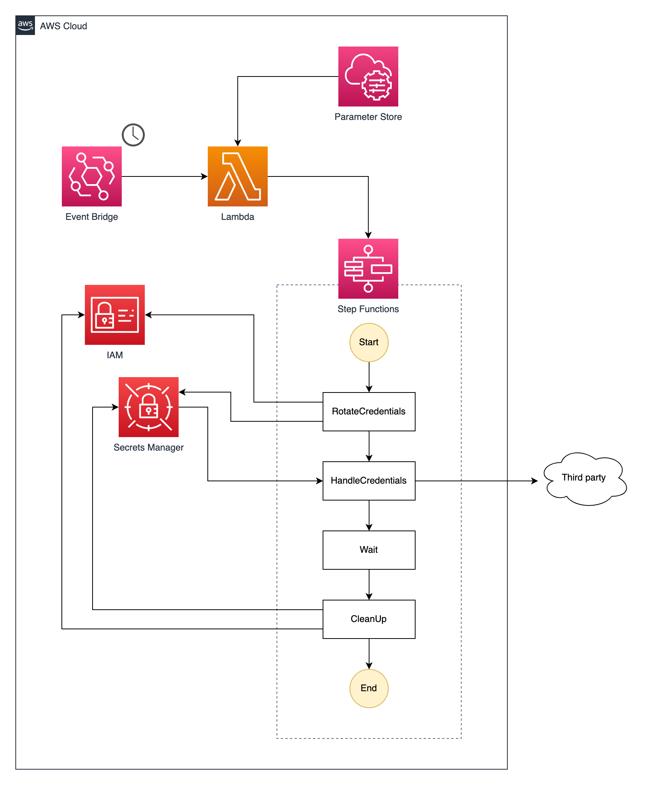

# IAM Credentials Rotator

AWS CDK construct for rotating IAM user credentials and sending to a third party.

## Usage

Simply provide a list of usernames of IAM users which exist in the target account and a Lambda function to handle the newly created credentials for a given user.

```typescript
const credentialsHandler = new lambda.Function(this, 'MyCredentialsHandler', {
  handler: 'index.handler',
  code: lambda.Code.fromAsset('path/to/your/code'),
  runtime: lambda.Runtime.NODEJS_14_X,
});

new IamCredentialsRotator(this, 'MyCredentialsRotator', {
  usernames: ['homer', 'marge', 'bart', 'lisa', 'maggie'],
  credentialsHandler,
});
```

The Lambda function, `credentialsHandler` is called immediately after a new access key is created for a user. The newly created credentials must be retrieved from AWS Secrets Manager using the secret name passed in to the function. 

By default, credentials are rotated once an hour. This can be changed by providing `scheduleDuration` in the constructor.

Below is a minimal boilerplate for your handler function.

```typescript
import {
  SecretsManagerClient,
  GetSecretValueCommand,
} from '@aws-sdk/client-secrets-manager';

const secretsManagerClient = new SecretsManagerClient({});

interface Event {
  username: string;
  secretName: string;
}

export async function handler(event: Event) {
  const { username, secretName } = event;
  const getSecretResponse = await secretsManagerClient.send(
    new GetSecretValueCommand({ SecretId: secretName }),
  );
  const { AccessKeyId, SecretAccessKey }: { [key: string]: string } =
    JSON.parse(getSecretResponse.SecretString || '');

  // Do something with AccessKeyId and SecretAccessKey here e.g. send to a trusted third-party
}
```

Once your function exits the secret will be deleted from AWS Secrets Manager and old credentials for the user are also deleted at this step.

## Architecture

